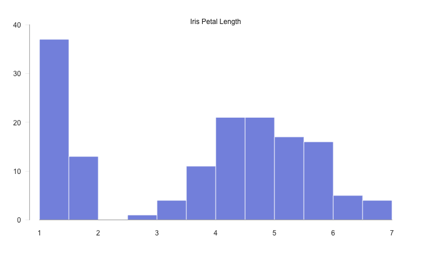

# [Got Plot](/gotplot) 

### Histogram 

 

-----

 
# ======================================================== 
# Data 
# ======================================================== 
# iris dataset 
data(iris) 
 
 
# ======================================================== 
# Plot 
# ======================================================== 
# set graphic margins 
op = par(mar = c(3, 3, 2, 2)) 
# histogram 
hist(iris$Petal.Length, ylim=c(0, 40), col = "#8595E1",  
     border = "white", main = "", xlab = "", ylab = "", axes = FALSE) 
# add axes 
axis(side = 1, pos = 0, at = seq(from=1, to=7, by=1), col = "gray70",  
     lwd.ticks = 0, cex.axis = 1, col.axis = "gray20", lwd = 1.5) 
axis(side = 2, at = seq(from=0, to=40, by=10), col = "gray70",  
     las = 2, lwd.ticks = 0.25, cex.axis = 1, col.axis = "gray20",  
     lwd = 1.5, line = -0.5) 
# add title 
mtext("Iris Petal Length", side=3, col="gray10", line=-1, cex=1) 
# turn off par 
par(op) 
 
