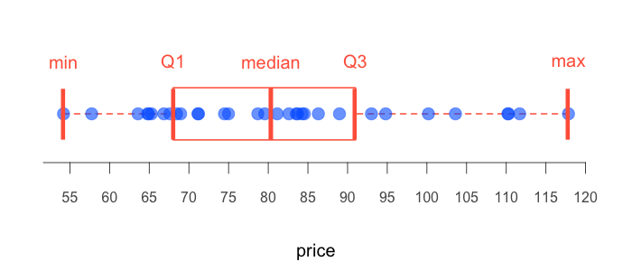

# [Got Plot](/gotplot) 

### Points Boxplot 

 

-----

 
# ======================================================== 
# Data 
# ======================================================== 
# price of tickets 
tickets <- c( 
  110.20, 117.84, 111.69, 103.60, 110.28, 94.80, 100.19, 
  93.01, 88.98, 84.55, 81.13, 82.61, 83.54, 74.99, 84.27,  
  86.32, 83.71, 78.69, 74.49, 71.21, 79.56, 71.14, 64.80, 
  65.28, 67.60, 68.96, 68.44, 64.92, 63.59, 57.75, 66.84, 
  54.20) 
 
 
# ======================================================== 
# Plot 
# ======================================================== 
png("points-boxplot.png", width = 700, height = 300, 
    pointsize = 20) 
op <- par(mar = c(4,2,2,2)) 
boxplot(tickets, horizontal = TRUE, axes = FALSE, 
        border = "tomato", lwd = 2) 
axis(side = 1, at = seq(50, 120, 5), cex.axis = 0.8, 
     line = -1, col.axis = "gray35") 
mtext("price", side = 1, line = 2.5) 
points(tickets, rep(1, length(tickets)), pch = 19, 
       col = hsv(0.6, 1, 1, 0.6), cex = 1.5) 
points(quantile(tickets, probs = c(0, 0.25, 0.5, 0.75, 1), type = 2),  
       rep(1, 5), pch = "|", col = "tomato", cex = 3) 
text(quantile(tickets, probs = c(0, 0.25, 0.5, 0.75, 1), type = 2),  
     rep(1.4, 5), labels = c("min", "Q1", "median", "Q3", "max"), 
     col = "tomato", cex = 1) 
par(op) 
dev.off() 
 
