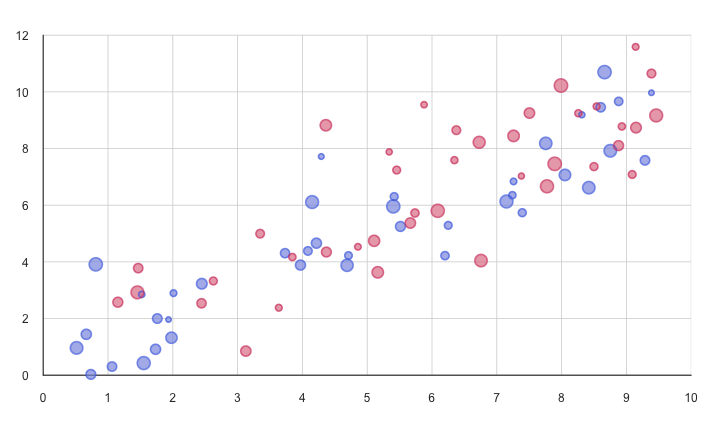

# [Got Plot](/gotplot) 

### Scatter Plot 

 

-----

 
# ======================================================== 
# Data 
# ======================================================== 
# setting seed for random numbers 
set.seed(1111) 
 
# random numbers for x-y coordinates 
x = runif(80, 0.5, 9.5) 
y = x + rnorm(80, 0, 1.5) 
y[y<0] = y[y<0] + runif(1, 1.5, 2) 
y[y>10] = y[y>10] - runif(1, 1, 2) 
 
# random numbers for point sizes 
size = runif(80, 1, 2.5) 
 
# factor with 2 categories 
group = gl(2, 40) 
 
# colors 
col_group <- col_border <- rep("", 80) 
col_group[group == 1] = "#8595E1AA" 
col_group[group == 2] = "#E07B91AA" 
col_border[group == 1] = "#4A6FE3AA" 
col_border[group == 2] = "#D33F6AAA" 
 
 
# ======================================================== 
# Plot 
# ======================================================== 
# set graphic margins 
op = par(mar = c(3, 3, 1.5, 2)) 
# call new plot 
plot.new() 
# define plot window 
plot.window(xlim = c(0,10), ylim = c(0, 12), xaxs = "i") 
# add horizontal grid lines 
abline(h = seq(from=0, to=12, by=2), col = "lightgray") 
# add vertical grid lines (don't use abline because it misbehaves) 
segments(0:12, rep(0, 12), 0:12, rep(12, 12), col = "lightgray") 
# add axes 
axis(side = 1, pos = 0, at = seq(from=0, to=10, by=1), col = "gray20",  
     lwd.ticks = 0, cex.axis = 1, col.axis = "gray20", lwd = 1.5) 
axis(side = 2, pos = 0, at = seq(from=0, to=12, by=2), col = "gray20",  
     las = 2, lwd.ticks = 0, cex.axis = 1, col.axis = "gray20", lwd = 1.5) 
# add points with color 
points(x, y, pch = 19, col = col_group, cex = 0.9 * size) 
# colored border of points 
points(x, y, pch = 1, col = col_border, lwd = 2, cex = size) 
# turn off par 
par(op) 
 
